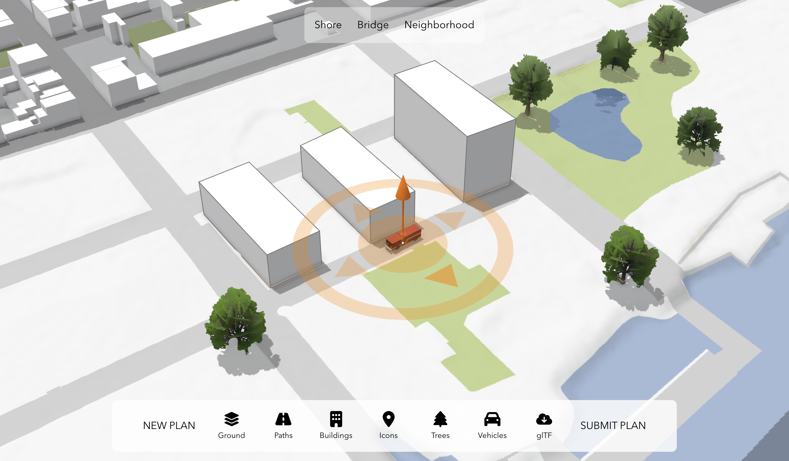

# 🌆 Zora-Cityplanning+AI  

**Decentralized Participatory Urban Planning Powered by AI & Zora Coins** 

[](https://esri.github.io/participatory-planning)

The app uses various API features such as [3D drawing](https://developers.arcgis.com/javascript/latest/api-reference/esri-widgets-Sketch.html), [glTF import](https://developers.arcgis.com/javascript/latest/sample-code/import-gltf/index.html) and [client-side filtering](https://developers.arcgis.com/javascript/latest/api-reference/esri-views-layers-support-FeatureFilter.html). The example scene used in the app is located in Dumbo, Brooklyn NY.

On the technical side the app is built using [React](https://react.dev/), [TypeScript](https://www.typescriptlang.org/), [vite](https://vite.dev/) and [npm](https://www.npmjs.com/)


## 🚨 Problem  
Urban planning is broken:  
- Decisions are made **top-down** with little community input.  
- Funding is **opaque** and slow.  
- Projects fail to reflect real-world needs (e.g., bike lanes that flood, parks nobody uses).  

Zora-Cityplanning+AI empowers citizens to **design, fund, and trade** the future of their cities.  

## ✨ Solution  
- **AI-Driven Proposals**: Predict project impact (traffic, environment, cost) using machine learning.  
- **Tokenized Governance**: Mint ERC-20 coins for proposals via Zora’s Coins Protocol.  
- **Onchain Democracy**: Stake tokens to vote, trade, and earn fees from implemented projects.  

## Instructions

To run the source code locally, follow these steps:

```
git clone https://github.com/Thycrescendo/Zora-Cityplanning-AI
cd Zora-Cityplanning-AI/
npm install
npm run dev
```

## Configuration

If you would like to use the app for a different area or city, see the [CONFIGURATION.md](./CONFIGURATION.md) file for details.

## Resources

The following external libraries, APIs, open datasets and specifications were used to make this application:

- [ArcGIS API for JavaScript](https://developers.arcgis.com/javascript/)
- Icons from [Font Awesome](https://fontawesome.com/)
- [Motion](https://motion.dev/) for animations
- [Sketchfab widget](https://sketchfab.com/developers/download-api/downloading-models/javascript) for downloading glTF models

## Disclaimer

This demo application is for illustrative purposes only and it is not maintained. The area in Dumbo, Brooklyn NY used in the application is a fictional redevelopment area. There is no support available for deployment or development of the application.


